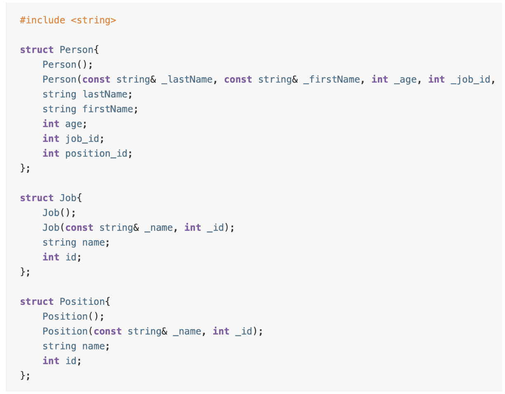
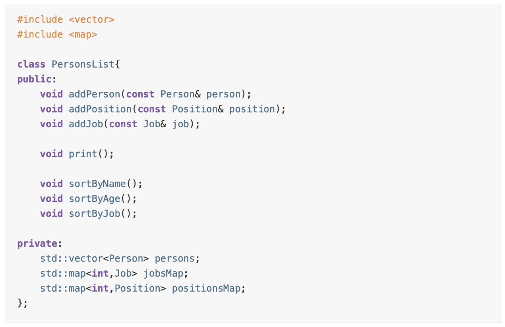
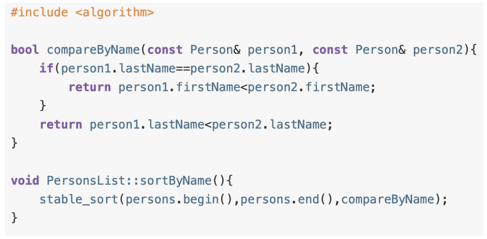

# Тестовое задание:  Создание компараторов для алгоритмов сортировки

### Постановка задачи
Консольная программа на C++ состоит из одного файла main.cpp из 150 строк. Наполняем условную базу данных работников. Есть классы Person (человек), Job (место работы), Position (должность).

Класс PersonsList хранит список людей в `std::vector`, а места работы и должности в `std::map`-ах, которые индексируются по id. Класс Person ссылается на Job и Position по их id.

В программе реализована функция сортировки по именам с помощью статической функции сравнения и `std::stable_sort`.

В main’е идет наполнение базы данных, сортировки и вывод результатов в консоль. 

Тестовое задание состоит в реализации сортировки по месту работы, причем не по id, а по названию. Важно, что в std::stable_sort третьим параметром передается функция, которая принимает только 2 элемента для сравнения. Поскольку указатель на класс не передается, то эта функция не может быть методом класса, а только статической.

Сложность задачи состоит в передаче дополнительных данных в функцию сравнения, которая используется сортировкой из стандартной библиотеки.

### Реализация
Сортировка по месту работы реализована с помощью передачи в функцию `std::stable_sort` лямбда выражения в качестве компаратора, которое позволяет захватить данные из объекта класса, а именно карты мест работы и должностей, тем самым давая возможность сравнивать объекты Person с учетом индексов из объектов Job и Position.